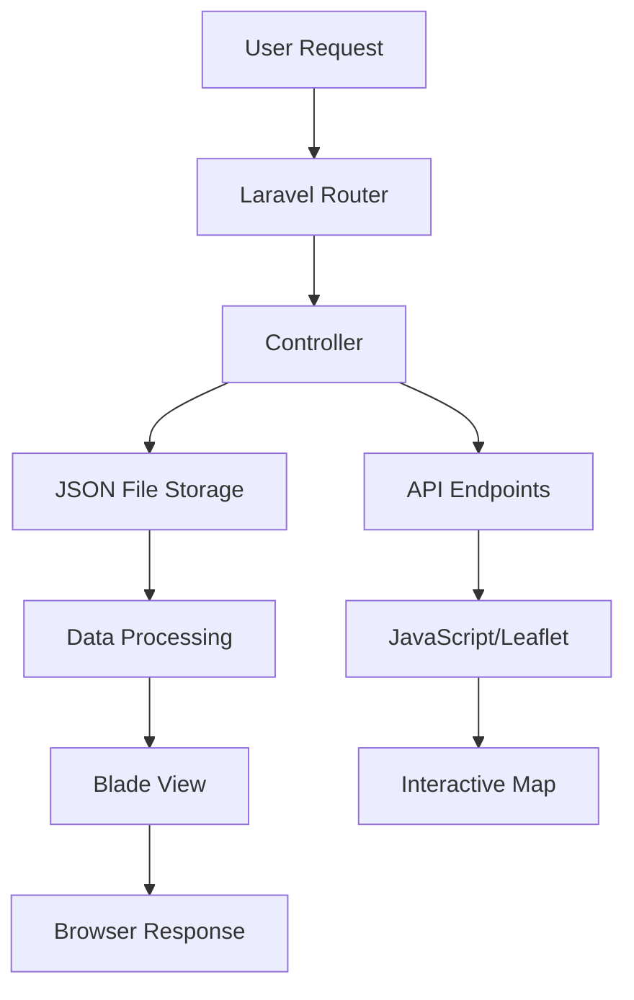

# 📋 **BinDay Laravel Application - Complete Evaluation & Development Guide**

## 🚀 **How to Run the Application Locally**

### **Prerequisites**
- **PHP 8.1+** (XAMPP recommended on Windows)
- **Composer** (PHP dependency manager)
- **Web browser** with modern JavaScript support

### **Local Development Setup**
```powershell
# 1. Navigate to project directory
cd C:\xampp\htdocs\binday

# 2. Install dependencies
composer install

# 3. Start the PHP development server
php -S 127.0.0.1:8000 -t public

# 4. Access the application
# Open browser to: http://127.0.0.1:8000
```

### **Key URLs**
- **Home**: `http://127.0.0.1:8000/`
- **Map View**: `http://127.0.0.1:8000/bins/map`
- **Map by Date**: `http://127.0.0.1:8000/bins/map-by-date`
- **Collections**: `http://127.0.0.1:8000/collections`
- **Areas Management**: `http://127.0.0.1:8000/areas`
- **Data Seeding**: `http://127.0.0.1:8000/admin/seed`

---

## 🏗️ **Application Architecture & Flow**

### **Core Framework**
- **Laravel 10.x** (PHP 8.1+)
- **No Database** - Uses JSON file storage for simplicity
- **File-based Data Storage**:
  - `storage/app/collections.json` - Collection bookings
  - `storage/app/allowed_areas.json` - Service areas

### **MVC Structure**

#### **Controllers**
1. **BinScheduleController** - Main controller, handles homepage, maps, and bins API
2. **CollectionController** - Manages collection bookings (CRUD operations)
3. **AllowedAreaController** - Manages service areas and geofencing
4. **DataSeederController** - Demo data seeding and management

#### **Views Structure**
```
resources/views/
├── bins/
│   ├── index.blade.php      # Homepage with navigation
│   ├── map.blade.php        # Interactive map with layer controls
│   └── map-date.blade.php   # Date-filtered map view
├── collections/
│   ├── index.blade.php      # List all collections
│   ├── create.blade.php     # Book new collection
│   ├── manage.blade.php     # Admin collection management
│   └── edit.blade.php       # Edit existing collection
├── areas/
│   ├── index.blade.php      # List/manage areas
│   ├── create-map.blade.php # Draw areas on map
│   └── edit.blade.php       # Edit area details
└── admin/
    └── seed-data.blade.php  # Data seeding interface
```

### **Key Features Implemented**

#### **1. 🗺️ Interactive Mapping**
- **Technology**: Leaflet.js with clustering
- **Features**: 
  - Layer controls for bin types and areas
  - Color-coded markers (Food: green, Recycling: blue, Garden: brown)
  - Polygonal area boundaries
  - Date filtering
  - Popup details with customer info

#### **2. 📊 Collection Management**
- **CRUD Operations**: Create, Read, Update, Delete collections
- **Area Validation**: Checks if addresses are within allowed service areas
- **Bin Types**: Food, Recycling, Garden (configurable per area)
- **Status Tracking**: Pending, Scheduled, Completed

#### **3. 🎯 Geofencing & Area Management**
- **Two Area Types**:
  - **Map-based**: Drawn polygons with point-in-polygon validation
  - **Postcode-based**: Traditional postcode area definitions
- **Geocoding**: Nominatim API integration for postcode → coordinates
- **Validation**: Prevents bookings outside service areas

#### **4. 🌱 Data Seeding System**
- **Demo Data**: Eccleshall area + 20 realistic collections
- **Flexible Seeding**: Seed areas only, collections only, or all data
- **Clean Management**: Delete all seeded data with one click
- **Real-time Status**: Shows current data counts

---

## 🔗 **Application Flow**

### **User Journey - Booking a Collection**
1. **Home Page** → "Book New Collection"
2. **Collection Form** → Enter customer details + address
3. **Area Validation** → System checks if address is in service area
4. **Success/Redirect** → Booking confirmed OR contact enquiries email
5. **Management** → Admin can view/edit via collections interface

### **Admin Journey - Managing Areas**
1. **Areas Page** → View current service areas
2. **Draw on Map** → Create precise polygonal boundaries
3. **Configure Bin Types** → Set which bin types are available
4. **Validation** → New bookings automatically validated against areas

### **Data Flow**


---

## 🛠️ **Technical Implementation Details**

### **Data Storage Strategy**
- **Why JSON Files**: Simplicity, no database setup required
- **File Locations**:
  - `storage/app/collections.json`
  - `storage/app/allowed_areas.json`
- **Data Structure**:
  ```json
  // Collections
  {
    "id": 1,
    "customer_name": "John Doe",
    "phone": "07123456789",
    "address": "123 Main St, Eccleshall",
    "bin_type": "Food",
    "collection_date": "2025-08-15",
    "collection_time": "09:30",
    "status": "Scheduled",
    "notes": "Leave at gate"
  }
  
  // Areas
  {
    "id": 1,
    "name": "Eccleshall",
    "type": "map",
    "bin_types": ["Food", "Recycling", "Garden"],
    "coordinates": [[lat,lng], [lat,lng], ...],
    "active": true
  }
  ```

### **Geofencing Implementation**
- **Point-in-Polygon Algorithm**: Ray casting algorithm for precise boundary checking
- **Fallback System**: Postcode-based validation when geocoding fails
- **Coordinate System**: WGS84 (standard GPS coordinates)

### **Map Technology Stack**
- **Base Map**: OpenStreetMap tiles
- **JavaScript Library**: Leaflet.js v1.9.4
- **Clustering**: Leaflet.markercluster for performance
- **Drawing Tools**: Leaflet.draw for area creation

---

## 🔮 **Future Development Notes**

### **Immediate Improvements**
1. **Database Migration**: Move from JSON to proper MySQL/PostgreSQL
2. **Authentication**: Implement proper admin/user roles
3. **Real Geocoding**: Replace Nominatim with Google Maps API for better accuracy
4. **Mobile Optimization**: Improve responsive design
5. **Error Handling**: More robust error handling and user feedback

### **Feature Enhancements**
1. **Route Optimization**: Calculate optimal collection routes
2. **Calendar Integration**: iCal export for collection schedules
3. **SMS Notifications**: Remind customers of collection dates
4. **Reporting Dashboard**: Analytics on collection data
5. **Multi-tenant**: Support multiple waste management companies

### **Performance Optimizations**
1. **Caching**: Implement Redis/Memcached for API responses
2. **API Pagination**: Paginate large collection lists
3. **Image Optimization**: Optimize map tiles and icons
4. **CDN Integration**: Serve static assets from CDN

### **Code Quality Improvements**
1. **Unit Tests**: Add PHPUnit tests for controllers
2. **API Documentation**: OpenAPI/Swagger documentation
3. **Code Standards**: Implement PHP-CS-Fixer
4. **Logging**: Structured logging for debugging
5. **Environment Config**: Proper .env configuration management

---

## 🐛 **Known Issues & Technical Debt**

### **Current Issues**
1. **URL Generation**: Required manual fix of `APP_URL` in `config/app.php`
2. **String Escaping**: Had apostrophe issues in addresses (fixed)
3. **Map-by-Date**: Recently fixed field name mismatches
4. **No .env.example**: Missing environment template file

### **Technical Debt**
1. **File-based Storage**: Should migrate to database for production
2. **Hardcoded Values**: Some coordinates and postcodes are hardcoded
3. **No Validation Classes**: Form validation is inline in controllers
4. **Monolithic Controllers**: Some controllers are getting large
5. **No Service Layer**: Business logic mixed with controllers

### **Security Considerations**
1. **Input Sanitization**: Basic XSS protection needed
2. **File Upload Security**: If file uploads added later
3. **Rate Limiting**: API endpoints should have rate limiting
4. **HTTPS Enforcement**: Force HTTPS in production

---

## 📝 **Development Workflow**

### **Making Changes**
1. **Always test locally** with `php -S 127.0.0.1:8000 -t public`
2. **Check logs** for errors if something doesn't work
3. **Use seeding system** to reset data during testing
4. **Test on multiple browsers** due to JavaScript map components

### **Common Commands**
```bash
# Start development server
php -S 127.0.0.1:8000 -t public

# Seed demo data
curl -X POST http://127.0.0.1:8000/admin/seed/all

# Clear all data
curl -X DELETE http://127.0.0.1:8000/admin/seed/delete

# Check API responses
curl http://127.0.0.1:8000/api/bins
curl http://127.0.0.1:8000/api/areas
```

### **File Structure Priorities**
- **Controllers**: `app/Http/Controllers/` - Main business logic
- **Views**: `resources/views/` - User interface templates  
- **Routes**: `routes/web.php` - URL mappings
- **Config**: `config/app.php` - Application settings
- **Data**: `storage/app/*.json` - Application data files

---

## 🔄 **Recent Development History**

### **Major Features Added**
1. **Collection Management System** - Full CRUD for waste collection bookings
2. **Geofencing & Area Management** - Define service areas with polygon drawing
3. **Interactive Maps** - Leaflet.js with layer controls and clustering
4. **Data Seeding System** - Demo data management with Eccleshall polygon
5. **Area-specific Bin Types** - Each area can have custom bin type configurations

### **Bug Fixes & Improvements**
1. **Fixed Laravel bootstrapping** - Resolved recurring file loss from git resets
2. **Fixed URL generation** - Corrected APP_URL configuration
3. **Fixed string escaping** - Handled apostrophes in addresses properly
4. **Fixed map-by-date functionality** - Corrected API field name mismatches
5. **Improved data persistence** - Implemented JSON file storage for areas and collections

This application represents a solid foundation for a waste collection management system with modern web technologies, geospatial features, and a clean user interface. The JSON-based storage makes it easy to develop and test, while the modular structure allows for easy migration to a database-backed system when needed.
